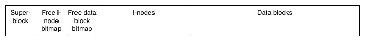

# FileFileSystem: A simulated filesystem
This project was made for the Tampere university course *COMP.CS.410 Operating Systems and Concurrency* as part of the course project. It implements a simulated file system and an interface that models some simplified Linux system calls for manipulating files. The file system lives in a single "real" binary file. The design is based on descriptions of the ext2 filesystem, as well as some general notes about filesystem architecture, from the 4th (global) edition of *Modern Operating Systems* (Tanenbaum & Bos, 2014). The simulated filesystem is called FileFileSystem, or FFSys, as in a filesystem inside a file.

## Running the program
The project comes with a very simple, thrown-together CLI program, which can be used to test the filesystem. The project can be built with CMake, by running for example `cmake -B build`, compiling with `make -C build` and finally running the `filefilesystem` executable inside the build directory. 

## Filesystem structure

The picture above represents the structure of a single FFSys-file, which is largely the same as the basic structure of ext2. The FFSys-file is divided into equal sized block, of which the first is called the superblock, that contains metadata about the filesystem. Then the second and third blocks are reserved for the free i-node bitmap and the free data block bitmap, respectively. After that come the i-nodes and the data blocks themselves. I-nodes (one per file) contain file metadata, and the data blocks contain file contents.

The maximum size of a single file is limited, based on the filesystem's block size. Right now, i-nodes are configured with 15 static data blocks and if needed, 5 pointers to "dynamically" reserved blocks that contain further addresses to the file's data blocks. With a block size of 1024, one file has the maximum capacity of:
	(15 + 5 \* 256) \* 1024 = 1326080 B ≈ 1.33 MB
The number 256 is the amount of addresses that can fit into a 1024 byte block. 

The size of a single block can be chosen when creating a file but it must be larger than what the superblock needs. Block size also determines the maximum amount of files and data blocks, since the bitmaps can only keep track of 8 * block size of them.

Yksinkertaistuksia tiedostojärjestelmän toimintaan on tehty verrattuna ext2:een tietysti paljon, mutta perusrakenne on sen pohjalta inspiroitunut. Yksi hyvin suuri ero on se, että FFSys on litteä tiedostorakenne, eli siinä ei ole hakemistoja: kaikki tiedostot ovat järjestelmän juuressa. Edellisestä johtuen tiedostojen nimet talletetaan suoraan tiedoston i-nodeen, ja nimillä on 16 merkin raja. Mitään tehokkuusalgoritmeja esimerkiksi tietojen hajauttamiseen tiedostojärjestelmässä paremmin ei ole myöskään toteutettu, vaan toteutukset ovat hyvin naiiveja. Tämä pätee esimerkiksi data blokkien ja i-nodejen varaamiseen, jossa vapaita paikkoja etsitään lineaarisesti ensimmäisestä lähtien ja varataan aina ensimmäinen löydetty vapaa paikka.

Big simplifications to the file system have of course been made when compared to ext2, but the basic structure is still based on it. A very big difference is that FFSys is a flat filesystem, meaning that it does not have directories: all files are essentially at the root. Due to this, the file names have also been placed directly into the i-nodes and are capped at 16 characters. There are no special algorithms for making the filesystem place files and their contents efficiently into the filesystem; the implementation is very naive in this regard, only searching linearly for the next free spot starting always from the beginning.  

## Project modules
In this section, the central modules that the source code consists of are presented. The project source code is contained inside the `src`-directory.

### FFSys class (ffsys.hh & ffsys.cpp)
The central part of the program, containing the internal logic of the filesystem and implementing an interface for manipulating it. The interface consists of the methods open, read, write, close and seek:
- *file_descriptor* **open**(*std::string* filename, *int* flags = 0):
	- Opens/creates (depending on the flags parameter) a file, creates a new file descriptor for it and returns it (or -1 in case of an error).
- *ssize_t* **read**(*file_descriptor* fd, *char*\* buffer, *size_t* count):
	- Reads the desired amount of bytes from the file corresponding to the file descriptor into the given buffer. Returns the actual amount of read bytes, or -1 in case of errors.
- *ssize_t* **write**(*file_descriptor* fd, *char*\* buffer, *size_t* count):
	- Corresponds to the **read** method, but in the other direction (writes bytes from the buffer into the file).
- *bool* **close**(*file_descriptor* fd):
	- Closes the file, freeing its file descriptor so that it no longer corresponds to the file. Returns false in case of errors.
- *bool* **seek**(*file_descriptor* fd, *size_t* pos):
	- Moves the read and write position of the file to the desired byte in the file. Returns false in case of errors.

Additionally, the class has a getter function errornum(), which returns the class's error status attribute (corresponds to errno). The class methods set the status to the corresponding ErrorNumber enum value in case of errors.

The class also has a few member functions for printing data to help with testing. The command line implementation located in the main program utilizes them.

### fs_objects.hh
Contains struct type definitions for the filesystem objects, more specifically i-nodes and the superblock.

### Main program (main.cpp)
Contains a simple command line implementation for testing the basic functions of the FFSys class (creating files, writing to and reading from them using input files), and inspecting its contents (printing FS data to the console). The help command lists the available commands.

### Bitmap class (bitmap.hh & bitmap.cpp)
Helper class for managing bitmaps. Can allocate/free the i-th bit, or the first free bit. Essentially a helper class for managing a byte array. Used in the FFSys class to model the i-node and data block bitmaps.

## Sources
Tanenbaum, A. S. & Bos, H. (2014). *Modern Operating Systems (4th ed.)*. Pearson Education Limited.
